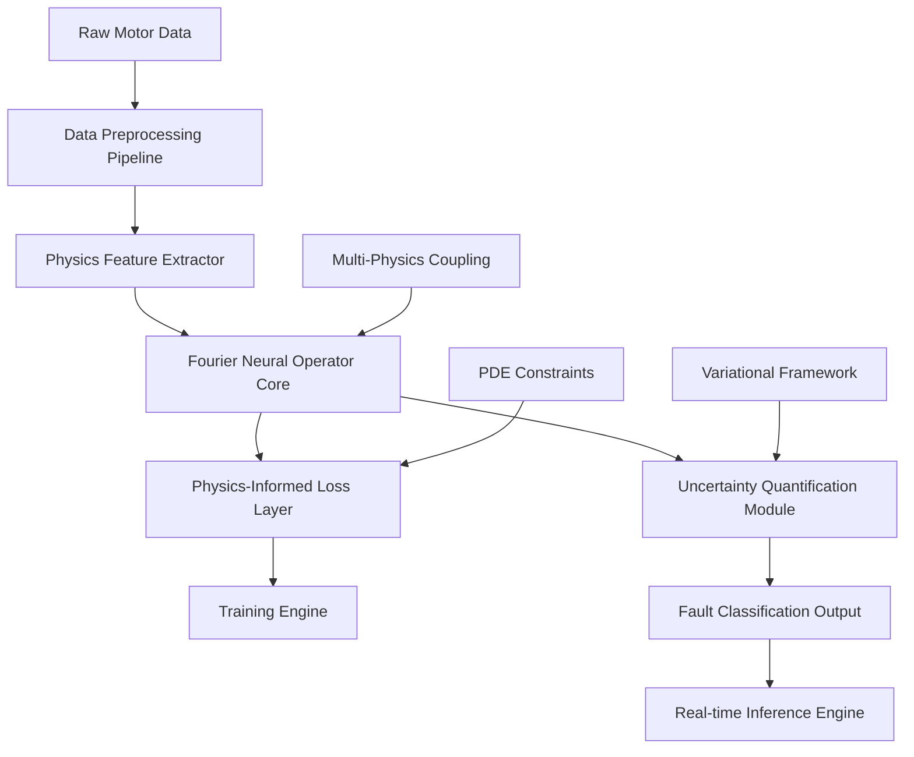

# Design Document: AV-PINO Motor Fault Diagnosis System

## Overview

The Adaptive Variational Physics-Informed Neural Operator (AV-PINO) system is designed as a unified framework that integrates physics-informed neural operators with real-time fault diagnosis for electric motor systems. The architecture treats motor control and fault detection as coupled operator learning tasks in infinite-dimensional function spaces, incorporating governing PDEs directly into the neural operator architecture.

### Key Design Principles

1. **Physics-First Approach**: Embed electromagnetic, thermal, and mechanical PDEs directly into the neural architecture
2. **Operator Learning**: Learn mappings between function spaces rather than point-wise predictions
3. **Uncertainty Quantification**: Provide probabilistic predictions with confidence measures
4. **Real-time Performance**: Achieve <1ms inference latency for industrial applications
5. **Generalization**: Maintain performance across different motor configurations

## Architecture

### High-Level System Architecture



### Core Components Architecture

The system follows a modular design with clear separation of concerns:

1. **Data Layer**: Handles CWRU dataset processing and real-time data ingestion
2. **Physics Layer**: Implements multi-physics modeling and constraint enforcement
3. **Neural Operator Layer**: Core FNO implementation with physics integration
4. **Inference Layer**: Real-time prediction engine with uncertainty quantification
5. **Visualization Layer**: Analysis and debugging tools

## Components and Interfaces

### 1. Data Processing Pipeline

**Purpose**: Transform raw vibration signals into physics-informed feature representations

**Key Components**:
- `CWRUDataLoader`: Handles dataset loading and preprocessing
- `SignalProcessor`: Implements time/frequency domain transformations
- `PhysicsFeatureExtractor`: Computes electromagnetic, thermal, mechanical features
- `DataAugmentation`: Generates synthetic fault scenarios

**Interfaces**:
```python
class DataProcessor:
    def load_cwru_dataset(self, path: str) -> Dataset
    def extract_physics_features(self, signals: Tensor) -> PhysicsFeatures
    def preprocess_for_training(self, data: Dataset) -> TrainingData
    def real_time_preprocessing(self, signal: Tensor) -> ProcessedSignal
```

### 2. Fourier Neural Operator Core

**Purpose**: Implement the core neural operator architecture with physics constraints

**Key Components**:
- `FourierLayer`: Spectral convolution in Fourier domain
- `PhysicsConstraintLayer`: Enforces PDE constraints during forward pass
- `MultiPhysicsCoupling`: Handles electromagnetic-thermal-mechanical coupling
- `OperatorNetwork`: Main neural operator architecture

**Interfaces**:
```python
class FourierNeuralOperator:
    def __init__(self, modes: int, width: int, physics_constraints: List[PDE])
    def forward(self, x: Tensor) -> Tuple[Tensor, PhysicsResiduals]
    def apply_physics_constraints(self, x: Tensor) -> Tensor
    def compute_operator_norm(self) -> float
```

### 3. Physics-Informed Loss System

**Purpose**: Combine data-driven loss with physics-based constraints

**Key Components**:
- `DataLoss`: Standard classification/regression loss
- `PhysicsLoss`: PDE residual computation
- `ConsistencyLoss`: Multi-physics coupling constraints
- `VariationalLoss`: Uncertainty quantification loss

**Interfaces**:
```python
class PhysicsInformedLoss:
    def compute_data_loss(self, pred: Tensor, target: Tensor) -> Tensor
    def compute_physics_loss(self, residuals: PhysicsResiduals) -> Tensor
    def compute_total_loss(self, pred: Tensor, target: Tensor, residuals: PhysicsResiduals) -> Tensor
    def get_loss_weights(self) -> Dict[str, float]
```

### 4. Uncertainty Quantification Module

**Purpose**: Provide probabilistic predictions with confidence measures

**Key Components**:
- `VariationalInference`: Bayesian neural operator implementation
- `UncertaintyEstimator`: Computes prediction uncertainties
- `ConfidenceCalibration`: Calibrates uncertainty estimates
- `SafetyThresholds`: Defines confidence thresholds for safety-critical decisions

**Interfaces**:
```python
class UncertaintyQuantification:
    def predict_with_uncertainty(self, x: Tensor) -> Tuple[Tensor, Tensor]
    def calibrate_confidence(self, predictions: Tensor, targets: Tensor) -> None
    def is_prediction_reliable(self, uncertainty: Tensor) -> bool
    def get_safety_threshold(self) -> float
```

### 5. Real-time Inference Engine

**Purpose**: Optimize model for <1ms inference on edge hardware

**Key Components**:
- `ModelOptimizer`: Quantization and pruning for edge deployment
- `InferenceEngine`: Optimized forward pass implementation
- `MemoryManager`: Efficient memory usage for real-time operation
- `HardwareProfiler`: Performance monitoring and optimization

**Interfaces**:
```python
class RealTimeInference:
    def optimize_for_edge(self, model: FourierNeuralOperator) -> OptimizedModel
    def predict_realtime(self, signal: Tensor) -> Tuple[Prediction, float]  # prediction, latency
    def profile_performance(self) -> PerformanceMetrics
    def set_hardware_constraints(self, constraints: HardwareConstraints) -> None
```

## Data Models

### Core Data Structures

```python
@dataclass
class MotorSignal:
    """Raw motor sensor data"""
    vibration: Tensor  # Time-series vibration data
    current: Tensor    # Motor current measurements
    voltage: Tensor    # Voltage measurements
    temperature: Tensor # Temperature readings
    timestamp: float
    sampling_rate: float
    motor_config: MotorConfiguration

@dataclass
class PhysicsFeatures:
    """Physics-informed feature representations"""
    electromagnetic: Tensor  # EM field features
    thermal: Tensor         # Heat transfer features
    mechanical: Tensor      # Vibration/structural features
    coupling_terms: Tensor  # Multi-physics coupling

@dataclass
class FaultPrediction:
    """Model prediction with uncertainty"""
    fault_type: str
    confidence: float
    uncertainty: float
    physics_consistency: float
    timestamp: float

@dataclass
class PhysicsResiduals:
    """PDE constraint violations"""
    maxwell_residual: Tensor
    heat_equation_residual: Tensor
    structural_dynamics_residual: Tensor
    coupling_residual: Tensor
```

### Physics Constraint Models

```python
class PDEConstraint:
    """Base class for physics constraints"""
    def compute_residual(self, prediction: Tensor, input: Tensor) -> Tensor
    def get_constraint_weight(self) -> float

class MaxwellConstraint(PDEConstraint):
    """Electromagnetic field constraints"""
    def compute_residual(self, E_field: Tensor, B_field: Tensor) -> Tensor

class HeatEquationConstraint(PDEConstraint):
    """Thermal dynamics constraints"""
    def compute_residual(self, temperature: Tensor, heat_source: Tensor) -> Tensor

class StructuralDynamicsConstraint(PDEConstraint):
    """Mechanical vibration constraints"""
    def compute_residual(self, displacement: Tensor, force: Tensor) -> Tensor
```

## Error Handling

### Error Categories and Handling Strategies

1. **Data Quality Errors**
   - Missing sensor data: Interpolation with physics-based constraints
   - Corrupted signals: Outlier detection and robust preprocessing
   - Sampling rate mismatches: Adaptive resampling with anti-aliasing

2. **Physics Constraint Violations**
   - PDE residual exceeding thresholds: Adaptive loss weighting
   - Energy conservation violations: Constraint projection methods
   - Multi-physics coupling inconsistencies: Variational constraint enforcement

3. **Model Performance Errors**
   - Inference latency exceeding 1ms: Dynamic model pruning
   - Accuracy below 90% threshold: Adaptive training with hard examples
   - Uncertainty calibration failures: Recalibration with validation data

4. **Hardware Resource Errors**
   - Memory constraints: Gradient checkpointing and model sharding
   - Compute limitations: Mixed precision training and inference
   - Edge deployment failures: Progressive model compression

### Error Recovery Mechanisms

```python
class ErrorHandler:
    def handle_data_quality_error(self, error: DataQualityError) -> ProcessedData
    def handle_physics_violation(self, violation: PhysicsViolation) -> CorrectedPrediction
    def handle_performance_degradation(self, metrics: PerformanceMetrics) -> OptimizationStrategy
    def handle_hardware_constraint(self, constraint: HardwareConstraint) -> ModelConfiguration
```

## Testing Strategy

### 1. Unit Testing
- **Physics Constraint Tests**: Verify PDE residual computations
- **Neural Operator Tests**: Test spectral convolution implementations
- **Data Processing Tests**: Validate feature extraction accuracy
- **Uncertainty Tests**: Check calibration and reliability metrics

### 2. Integration Testing
- **End-to-End Pipeline**: Full data flow from raw signals to predictions
- **Multi-Physics Coupling**: Verify electromagnetic-thermal-mechanical interactions
- **Real-time Performance**: Latency and throughput benchmarking
- **Hardware Compatibility**: Edge device deployment testing

### 3. Physics Validation Testing
- **Synthetic Data Tests**: Known analytical solutions for PDE validation
- **Conservation Law Tests**: Energy, momentum, and charge conservation
- **Boundary Condition Tests**: Proper handling of domain boundaries
- **Scaling Law Tests**: Verify physical scaling relationships

### 4. Performance Testing
- **Accuracy Benchmarking**: Compare against traditional ML methods
- **Generalization Testing**: Cross-motor configuration validation
- **Robustness Testing**: Performance under noise and adversarial conditions
- **Scalability Testing**: Performance with varying dataset sizes

### 5. Safety and Reliability Testing
- **Uncertainty Calibration**: Verify confidence measure accuracy
- **Failure Mode Analysis**: Identify and characterize failure conditions
- **Safety Threshold Validation**: Test critical decision boundaries
- **Fault Injection Testing**: System behavior under component failures

### Test Data Strategy
- **CWRU Dataset**: Primary validation on standard bearing fault data
- **Synthetic Physics Data**: Generated from known PDE solutions
- **Industrial Data**: Real-world motor data for final validation
- **Adversarial Examples**: Challenging cases for robustness testing

### Continuous Integration
- Automated testing pipeline with physics validation
- Performance regression detection
- Hardware compatibility checks
- Documentation and reproducibility verification