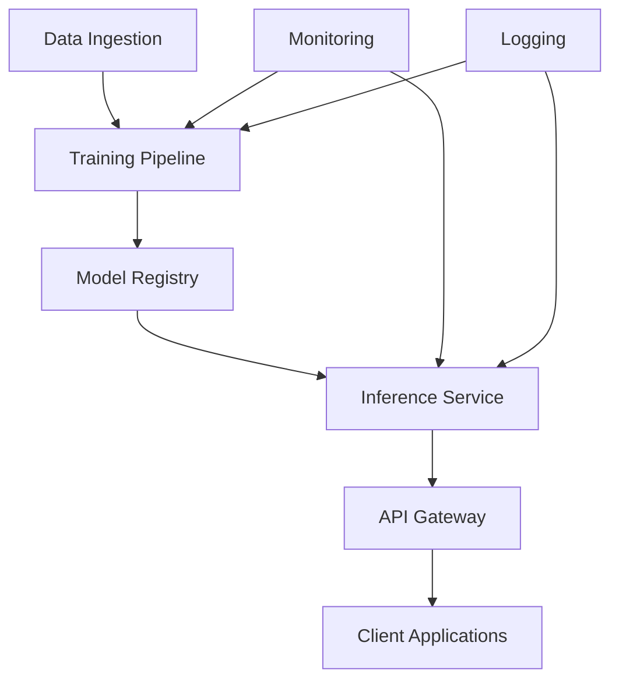

# Cloud Deployment Guide

This guide covers deploying the AV-PINO Motor Fault Diagnosis system in cloud environments for scalable training and inference.

## Supported Cloud Platforms

### Amazon Web Services (AWS)
- EC2 instances with GPU support
- SageMaker for managed ML workflows
- Lambda for serverless inference
- ECS/EKS for containerized deployment

### Google Cloud Platform (GCP)
- Compute Engine with GPU support
- AI Platform for managed ML
- Cloud Functions for serverless
- GKE for Kubernetes deployment

### Microsoft Azure
- Virtual Machines with GPU support
- Azure Machine Learning
- Azure Functions for serverless
- AKS for Kubernetes deployment

## Architecture Overview



## AWS Deployment

### Prerequisites

```bash
# Install AWS CLI
pip install awscli

# Configure AWS credentials
aws configure
```

### Training on AWS SageMaker

```python
# sagemaker_training.py
import sagemaker
from sagemaker.pytorch import PyTorch

# Define training job
pytorch_estimator = PyTorch(
    entry_point='train.py',
    source_dir='src/training',
    role=sagemaker.get_execution_role(),
    instance_type='ml.p3.2xlarge',
    instance_count=1,
    framework_version='2.0.0',
    py_version='py39',
    hyperparameters={
        'epochs': 100,
        'batch-size': 32,
        'learning-rate': 0.001
    }
)

# Start training
pytorch_estimator.fit({'training': 's3://your-bucket/training-data'})
```

### Inference on AWS Lambda

```python
# lambda_inference.py
import json
import torch
import numpy as np
from src.inference.realtime_inference import RealTimeInference

# Global model loading (outside handler for reuse)
inference_engine = None

def lambda_handler(event, context):
    global inference_engine
    
    if inference_engine is None:
        # Load model on cold start
        inference_engine = RealTimeInference.load_from_s3(
            bucket='your-model-bucket',
            key='models/av-pino-optimized.pth'
        )
    
    # Parse input data
    signal_data = np.array(event['signal'])
    
    # Run inference
    prediction, uncertainty = inference_engine.predict(signal_data)
    
    return {
        'statusCode': 200,
        'body': json.dumps({
            'fault_type': prediction.fault_type,
            'confidence': float(prediction.confidence),
            'uncertainty': float(uncertainty)
        })
    }
```

### ECS Deployment

```yaml
# docker-compose.yml for ECS
version: '3.8'
services:
  av-pino-training:
    image: av-pino:latest
    command: python -m src.training.training_engine
    environment:
      - AWS_DEFAULT_REGION=us-west-2
      - S3_BUCKET=your-data-bucket
    volumes:
      - ./configs:/app/configs
    deploy:
      resources:
        reservations:
          devices:
            - driver: nvidia
              count: 1
              capabilities: [gpu]

  av-pino-inference:
    image: av-pino:latest
    command: python -m src.inference.realtime_inference --serve
    ports:
      - "8080:8080"
    environment:
      - MODEL_PATH=s3://your-model-bucket/models/
    deploy:
      replicas: 3
```

## Google Cloud Platform Deployment

### AI Platform Training

```python
# gcp_training.py
from google.cloud import aiplatform

aiplatform.init(project='your-project-id', location='us-central1')

# Create custom training job
job = aiplatform.CustomTrainingJob(
    display_name='av-pino-training',
    script_path='src/training/train.py',
    container_uri='gcr.io/cloud-aiplatform/training/pytorch-gpu.1-13:latest',
    requirements=['torch>=2.0.0', 'numpy>=1.21.0'],
    machine_type='n1-standard-4',
    accelerator_type='NVIDIA_TESLA_V100',
    accelerator_count=1
)

# Run training
job.run(
    dataset=dataset,
    model_display_name='av-pino-model',
    args=['--epochs', '100', '--batch-size', '32']
)
```

### Cloud Functions Deployment

```python
# main.py for Cloud Functions
import functions_framework
import numpy as np
from src.inference.realtime_inference import RealTimeInference

# Initialize model (cached across invocations)
inference_engine = RealTimeInference.load_from_gcs(
    bucket='your-model-bucket',
    blob='models/av-pino-optimized.pth'
)

@functions_framework.http
def predict_fault(request):
    """HTTP Cloud Function for fault prediction."""
    request_json = request.get_json()
    
    if not request_json or 'signal' not in request_json:
        return {'error': 'Missing signal data'}, 400
    
    # Process input
    signal_data = np.array(request_json['signal'])
    
    # Run inference
    prediction, uncertainty = inference_engine.predict(signal_data)
    
    return {
        'fault_type': prediction.fault_type,
        'confidence': float(prediction.confidence),
        'uncertainty': float(uncertainty)
    }
```

## Azure Deployment

### Azure Machine Learning

```python
# azure_training.py
from azureml.core import Workspace, Experiment, ScriptRunConfig
from azureml.core.compute import ComputeTarget, AmlCompute

# Connect to workspace
ws = Workspace.from_config()

# Create compute target
compute_config = AmlCompute.provisioning_configuration(
    vm_size='Standard_NC6s_v3',
    max_nodes=4
)
compute_target = ComputeTarget.create(ws, 'gpu-cluster', compute_config)

# Create experiment
experiment = Experiment(workspace=ws, name='av-pino-training')

# Configure training run
config = ScriptRunConfig(
    source_directory='src/training',
    script='train.py',
    compute_target=compute_target,
    environment='pytorch-2.0-gpu'
)

# Submit training job
run = experiment.submit(config)
```

## Kubernetes Deployment

### Deployment Manifests

```yaml
# k8s-deployment.yaml
apiVersion: apps/v1
kind: Deployment
metadata:
  name: av-pino-inference
spec:
  replicas: 3
  selector:
    matchLabels:
      app: av-pino-inference
  template:
    metadata:
      labels:
        app: av-pino-inference
    spec:
      containers:
      - name: inference
        image: av-pino:latest
        ports:
        - containerPort: 8080
        env:
        - name: MODEL_PATH
          value: "/models/av-pino-optimized.pth"
        resources:
          requests:
            memory: "2Gi"
            cpu: "1"
            nvidia.com/gpu: 1
          limits:
            memory: "4Gi"
            cpu: "2"
            nvidia.com/gpu: 1
        volumeMounts:
        - name: model-storage
          mountPath: /models
      volumes:
      - name: model-storage
        persistentVolumeClaim:
          claimName: model-pvc

---
apiVersion: v1
kind: Service
metadata:
  name: av-pino-service
spec:
  selector:
    app: av-pino-inference
  ports:
  - port: 80
    targetPort: 8080
  type: LoadBalancer
```

### Horizontal Pod Autoscaler

```yaml
# hpa.yaml
apiVersion: autoscaling/v2
kind: HorizontalPodAutoscaler
metadata:
  name: av-pino-hpa
spec:
  scaleTargetRef:
    apiVersion: apps/v1
    kind: Deployment
    name: av-pino-inference
  minReplicas: 2
  maxReplicas: 10
  metrics:
  - type: Resource
    resource:
      name: cpu
      target:
        type: Utilization
        averageUtilization: 70
  - type: Resource
    resource:
      name: memory
      target:
        type: Utilization
        averageUtilization: 80
```

## Monitoring and Observability

### Prometheus Metrics

```python
# metrics.py
from prometheus_client import Counter, Histogram, Gauge, start_http_server

# Define metrics
INFERENCE_REQUESTS = Counter('inference_requests_total', 'Total inference requests')
INFERENCE_LATENCY = Histogram('inference_latency_seconds', 'Inference latency')
MODEL_ACCURACY = Gauge('model_accuracy', 'Current model accuracy')
PHYSICS_VIOLATIONS = Counter('physics_violations_total', 'Physics constraint violations')

class MetricsCollector:
    def __init__(self):
        start_http_server(8000)  # Metrics endpoint
    
    def record_inference(self, latency, accuracy):
        INFERENCE_REQUESTS.inc()
        INFERENCE_LATENCY.observe(latency)
        MODEL_ACCURACY.set(accuracy)
    
    def record_physics_violation(self):
        PHYSICS_VIOLATIONS.inc()
```

### Logging Configuration

```yaml
# logging-config.yaml
version: 1
formatters:
  default:
    format: '%(asctime)s - %(name)s - %(levelname)s - %(message)s'
  json:
    format: '{"timestamp": "%(asctime)s", "logger": "%(name)s", "level": "%(levelname)s", "message": "%(message)s"}'

handlers:
  console:
    class: logging.StreamHandler
    level: INFO
    formatter: default
    stream: ext://sys.stdout
  
  file:
    class: logging.handlers.RotatingFileHandler
    level: DEBUG
    formatter: json
    filename: /var/log/av-pino/app.log
    maxBytes: 10485760
    backupCount: 5

loggers:
  av_pino:
    level: DEBUG
    handlers: [console, file]
    propagate: false

root:
  level: INFO
  handlers: [console]
```

## Security Best Practices

### Network Security
- Use VPC/VNet for network isolation
- Configure security groups/NSGs
- Enable HTTPS/TLS encryption
- Implement API authentication

### Data Security
- Encrypt data at rest and in transit
- Use managed identity services
- Implement proper access controls
- Regular security audits

### Model Security
- Sign and verify model artifacts
- Implement model versioning
- Monitor for model drift
- Protect against adversarial attacks

## Cost Optimization

### Resource Management
- Use spot/preemptible instances for training
- Implement auto-scaling policies
- Schedule non-critical workloads
- Monitor and optimize resource usage

### Storage Optimization
- Use appropriate storage tiers
- Implement data lifecycle policies
- Compress model artifacts
- Cache frequently accessed data

## Disaster Recovery

### Backup Strategy
- Regular model and data backups
- Cross-region replication
- Automated backup verification
- Recovery time objectives (RTO)

### High Availability
- Multi-zone deployments
- Load balancing
- Health checks and failover
- Circuit breaker patterns

## Performance Tuning

### Training Optimization
- Distributed training across multiple GPUs
- Mixed precision training
- Gradient accumulation
- Data loading optimization

### Inference Optimization
- Model serving optimization
- Batch inference for throughput
- Caching strategies
- Connection pooling

## Troubleshooting

### Common Issues
1. **Out of Memory**: Reduce batch size, enable gradient checkpointing
2. **Slow Training**: Check data loading, use distributed training
3. **High Latency**: Optimize model, use caching, scale horizontally
4. **Cost Overruns**: Monitor usage, implement auto-scaling, use spot instances

### Debug Tools
```bash
# Check resource usage
kubectl top pods
kubectl describe pod <pod-name>

# View logs
kubectl logs <pod-name> -f

# Debug networking
kubectl exec -it <pod-name> -- netstat -tlnp
```

## Support and Resources

- **Cloud Provider Documentation**
  - [AWS SageMaker](https://docs.aws.amazon.com/sagemaker/)
  - [GCP AI Platform](https://cloud.google.com/ai-platform/docs)
  - [Azure ML](https://docs.microsoft.com/en-us/azure/machine-learning/)
- **Kubernetes**: [Official Documentation](https://kubernetes.io/docs/)
- **Monitoring**: [Prometheus](https://prometheus.io/docs/), [Grafana](https://grafana.com/docs/)
- **Support**: Contact cloud support teams for platform-specific issues